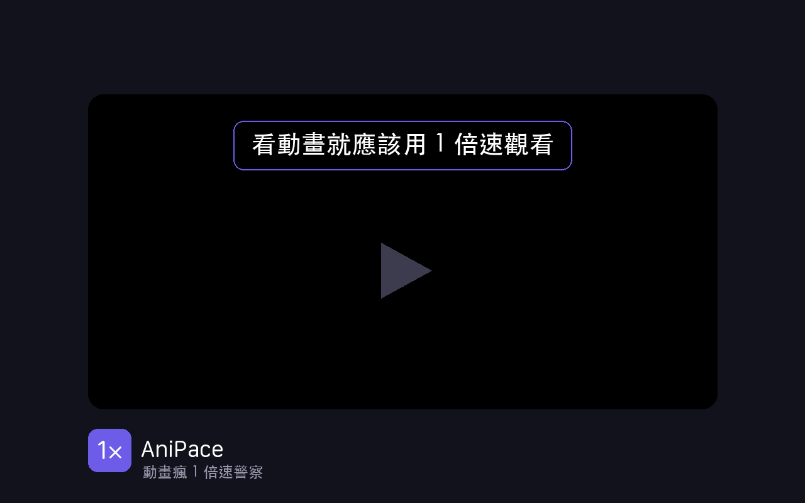

  

  

---

在 [動畫瘋](https://ani.gamer.com.tw) 上,把播放速度強制維持在 1 倍速。

## 安裝

### Chrome Web Store

[從 Chrome Web Store 安裝](https://chromewebstore.google.com/detail/anipace/endobggedcamcjbkpncaigfahfkbhpga)。

### 開發者模式

1. 下載 / `git clone` 這個 repo
2. Chrome 開 `chrome://extensions`
3. 右上角開「開發者模式」
4. 「載入未封裝項目」→ 選這個資料夾

## 授權

[MIT](LICENSE)
